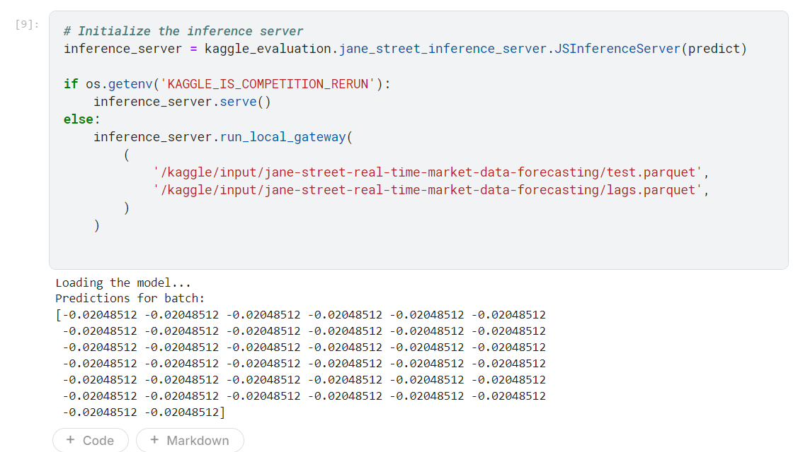

# Jane Street Real-Time Prediction in Trading
This project is aimed at solving the Jane Street Market Prediction competition using machine learning techniques. We followed a series of steps from data exploration to model training, evaluation, and submission.

## Project Structure
The project consists of the following scripts:

- `explore_data.py`
- `advanced_analysis.py`
- `merge_lags_training.py`
- `train_model.py`
- `R².py`
- `predict.py`
- `evaluate_compet.py`
- Kaggle Notebook

## Workflow
### 1. `explore_data.py`
The first step of the project involved exploring the data. The `explore_data.py` script was written to preview the training, lag features, and test data. The preview consisted of:

- Printing a few rows of the dataset.
- Displaying all column names along with their data types.

This gave us an initial understanding of the data's structure and allowed us to identify potential issues early on.

### 2. `advanced_analysis.py`
Next, we focused on analyzing the dataset thoroughly. The goal was to gather information about:

- Total number of files, rows, and columns.
- Missing data and percentages of missing data for each column.
- Correlations between features for the whole dataset, to help with feature selection.

Initially, we attempted to analyze the entire dataset in one go, but due to the large size, the system’s memory saturated, causing crashes. As a result, we switched to processing the data in smaller chunks (batches) and saved the analysis results in a JSON file.

We also created a log file to track which `date_id` was being analyzed so that if the script failed, we could resume from the last analyzed `date_id`.

We optimized the chunk sizes by balancing memory usage with the number of batches. Additionally, we leveraged the `dask` library for parallel processing to speed up the analysis.

Key steps:

- Eliminated features with more than 80% missing data.
- Found that the high abstraction level of the data made it difficult to identify meaningful patterns or correlations between features.

### 3. `train_model.py`
After completing the initial analysis, we were unsure of the next steps. To gain some insights, we read through discussions on the competition forum and found that many teams had used regression models, with variations such as combining regression and neural networks.

Based on this, we selected **XGBoost** (a gradient boosting regression model) for training. After training the model, we generated our first predictions.

However, the initial predictions were all the same (40 identical values). After debugging, we realized that:

- The test data we were using was a template with all zero values.
- The real test data was generated via the Kaggle API.
- We were also training with parquet files without incorporating lag features.

### 4. `merge_lags_training.py`
To address the issues, we merged the lag features with the training data. Once the lags were added, we retrained the model and utilized the Kaggle API for generating the test data. The predictions now varied, producing 40 different values, which indicated progress.

### 5. `R².py`
After each training phase, we evaluated the model’s performance using the **R² score** (as outlined in the competition's evaluation criteria). This helped us understand how well the model was performing and whether it was improving over time.

### 6. `predict.py`
This script tests our prediction model using test data (**two `date_id`s that the professor provided**).

### 7. `evaluate_compet.py`
This was today's last modification. Our class representative, Marcin, asked us to compare our results on the same test data.

### 8. Kaggle Notebook
We worked on both Kaggle's notebook and our local machine. Each script generated output files that were used as inputs for the next stage of the workflow.

Finally, we integrated all scripts (starting from model training to validation, evaluation, and prediction) into a **Kaggle notebook**. This notebook allowed us to submit the results to the competition in a streamlined manner, with all steps executed on the Kaggle platform.

